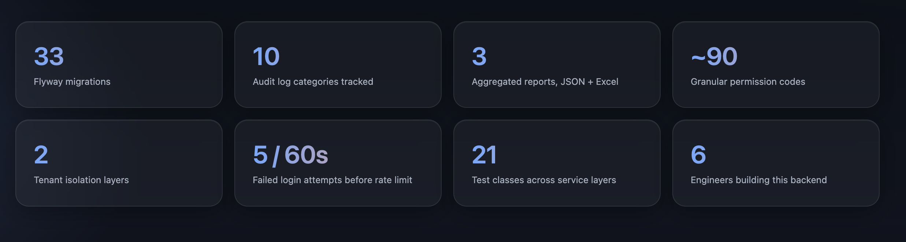
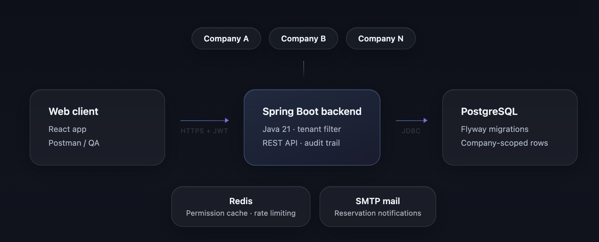
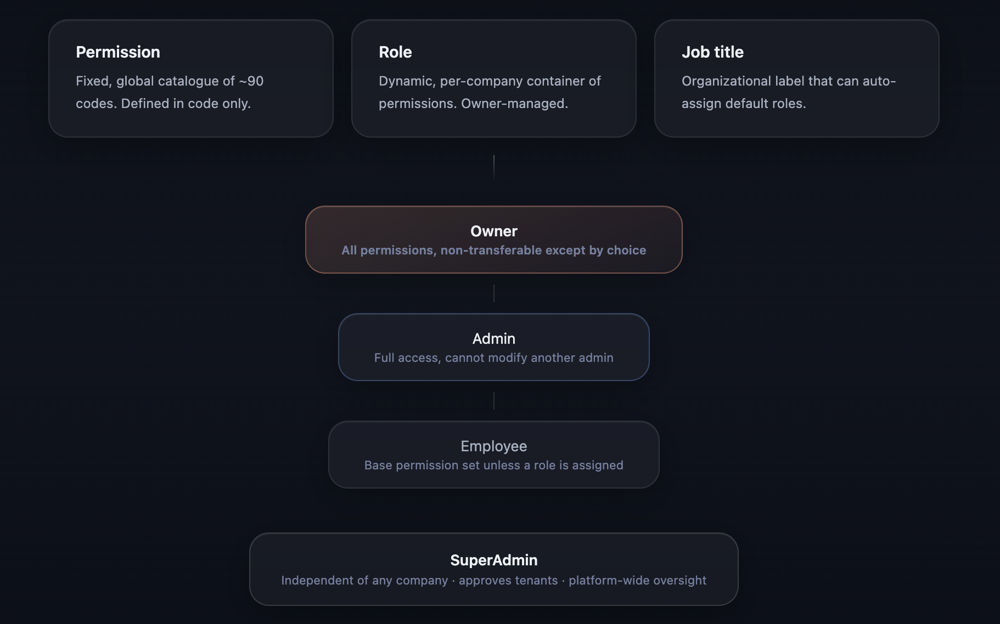
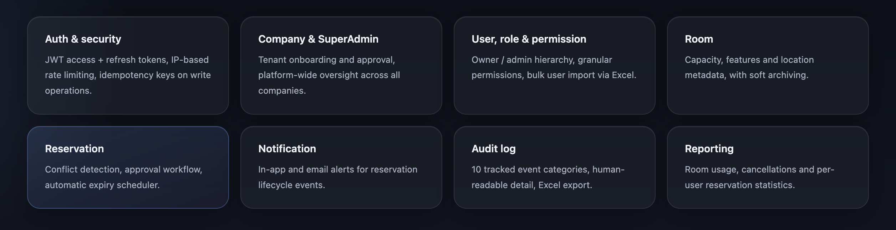

# Visitor & Meeting Room Management System

> A multi-tenant SaaS backend for company-wide meeting room reservations — with granular permissions, audit logging, and usage reporting built in from day one.

---

## Overview

This is a production-ready REST API backend for a meeting room reservation platform, built with **Spring Boot**, **Java 21**, and **PostgreSQL**. Unlike a single-company booking tool, the system is designed as a **multi-tenant SaaS**: any number of companies can operate on the same backend and database, each fully isolated from the others, while a platform-level SuperAdmin oversees onboarding and cross-company reporting.

The system was built during a company internship and is intended for real production use, not as a class assignment — every design decision (tenant isolation, permission granularity, audit trail, fault tolerance) reflects that.

A companion React web client consumes this API — see [Related](#related).

---

## Project at a glance



33 versioned database migrations, 10 tracked audit log categories, roughly 90 granular permission codes, and two independent layers of tenant isolation — this backend was hardened well beyond a typical CRUD API over the course of development.

---

## System Architecture



Every company shares the same Spring Boot backend and PostgreSQL database. Requests arrive over HTTPS carrying a JWT that identifies both the user and their company. Redis backs two supporting concerns — caching resolved permissions so they aren't recomputed on every request, and rate limiting repeated failed login attempts — while SMTP delivers reservation lifecycle notifications by email. Tenant isolation happens at the database query level, not just in application code: see [Security](#security) for how.

---

## Authorization Model



Access control is built from three independent concepts rather than a single flat role list:

- **Permission** — a fixed, global catalogue of roughly 90 codes (`ROOM_CREATE`, `RESERVATION_APPROVE`, and so on), extensible only in code, never by a company.
- **Role** — a per-company, fully dynamic container of permissions that a company's owner can create, edit, or delete freely.
- **Job title** — an organizational label that can optionally carry default roles, auto-assigned once when a user is given that title.

On top of this sits a fixed trust hierarchy: the **Owner** holds every permission automatically and cannot be edited by anyone else; an **Admin** has full access but cannot modify another admin, preventing privilege lockout fights; a plain **Employee** falls back to a base permission set until a role is assigned. The **SuperAdmin** sits outside all of this — independent of any company, with its own authentication flow, responsible for approving new tenants and auditing the platform as a whole.

---

## Feature Modules



| Module | Description |
|---|---|
| **Auth & security** | JWT access + refresh tokens, IP-based login rate limiting, idempotency keys on write operations |
| **Company & SuperAdmin** | Tenant onboarding and approval, platform-wide oversight across all companies |
| **User, role & permission** | Owner / admin hierarchy, granular permission overrides, bulk user import via Excel |
| **Room** | Capacity, location, and configurable features, with soft archiving |
| **Reservation** | Conflict detection, an approval workflow with deadlines, automatic expiry scheduler |
| **Notification** | In-app and email alerts across the reservation lifecycle |
| **Audit log** | 10 tracked event categories, human-readable detail, category-grouped Excel export |
| **Reporting** | Room usage, cancellation stats, and per-user reservation statistics — JSON and Excel |

---

## Tech Stack

| Category | Technology |
|---|---|
| **Language** | Java 21 |
| **Framework** | Spring Boot |
| **Security** | Spring Security, JWT (jjwt) |
| **Database** | PostgreSQL, Spring Data JPA, Hibernate |
| **Cache & rate limiting** | Redis |
| **Migrations** | Flyway (33 versioned migrations) |
| **Mapping** | MapStruct |
| **Boilerplate** | Lombok |
| **Excel import / export** | Apache POI |
| **Email** | Spring Mail (SMTP) |
| **Testing** | JUnit 5, Mockito |
| **Build** | Maven |

---

## Project Structure

```
src/main/java/com/yasarbilgi/visitormeetingmanagment/
├── auth/               # Login, refresh, logout, change password, login history
├── security/           # JWT filter, tenant interceptors, rate limiting, idempotency
├── company/            # Tenant entity, onboarding
├── platform/           # SuperAdmin authentication and platform-wide operations
├── user/               # User CRUD, bulk import, permanent deletion
├── role/                # Dynamic per-company roles
├── permission/         # Fixed global permission catalogue
├── userpermission/     # Per-user permission overrides
├── job/                # Job titles with default role assignment
├── department/         # Department management
├── room/               # Room CRUD, features, archiving
├── feature/             # Room feature catalogue (projector, whiteboard, etc.)
├── reservation/        # Booking, approval workflow, conflict detection, expiry scheduler
├── notification/       # In-app + email notifications
├── audit/              # Audit log recording, viewing, Excel export
├── report/              # Room usage, cancellation, and reservation-count reports
└── common/
    ├── base/           # BaseEntity, TenantBaseEntity (Hibernate tenant filter)
    ├── config/         # Security, CORS, web MVC configuration
    ├── exception/      # GlobalExceptionHandler, ErrorCode catalogue
    ├── idempotency/    # Idempotency-Key filter
    ├── ratelimit/      # Login rate limiting filter
    └── response/       # ApiResponse, PageResponse envelopes
```

---

## API Endpoints

### Auth
| Method | Endpoint | Description |
|---|---|---|
| `POST` | `/api/v1/auth/login` | Login with email or username |
| `GET` | `/api/v1/auth/me` | Get the current user's profile |
| `GET` | `/api/v1/auth/my-login-history` | View your own login/logout history |
| `POST` | `/api/v1/auth/refresh` | Refresh the access token |
| `POST` | `/api/v1/auth/logout` | Logout and revoke the refresh token |
| `POST` | `/api/v1/auth/change-password` | Change your own password |
| `POST` | `/api/v1/platform/auth/login` | SuperAdmin login (separate flow) |

### Rooms
| Method | Endpoint | Description |
|---|---|---|
| `POST` | `/api/v1/rooms` | Create a room |
| `GET` | `/api/v1/rooms` | List rooms (paginated, filterable) |
| `GET` | `/api/v1/rooms/{id}` | Get a room by ID |
| `PUT` | `/api/v1/rooms/{id}` | Update a room |
| `PATCH` | `/api/v1/rooms/{id}/activate` | Reactivate a room |
| `PATCH` | `/api/v1/rooms/{id}/deactivate` | Deactivate a room |
| `DELETE` | `/api/v1/rooms/{id}` | Archive a room |

### Reservations
| Method | Endpoint | Description |
|---|---|---|
| `POST` | `/api/v1/reservations` | Request a reservation |
| `GET` | `/api/v1/reservations/calendar` | View room availability |
| `PATCH` | `/api/v1/reservations/{id}/approve` | Approve a pending request |
| `PATCH` | `/api/v1/reservations/{id}/reject` | Reject a pending request |
| `PATCH` | `/api/v1/reservations/{id}/cancel` | Cancel a reservation |
| `PATCH` | `/api/v1/reservations/{id}/participants/{userId}` | Add a participant |
| `DELETE` | `/api/v1/reservations/{id}/participants/{userId}` | Remove a participant |

### Users
| Method | Endpoint | Description |
|---|---|---|
| `POST` | `/api/v1/companies/{companyId}/users` | Create a user |
| `GET` | `/api/v1/companies/{companyId}/users/search` | Search users by keyword |
| `PUT` | `/api/v1/companies/{companyId}/users/{userId}` | Update a user's profile |
| `PATCH` | `/api/v1/companies/{companyId}/users/{userId}/roles/{roleId}` | Assign a role |
| `PATCH` | `/api/v1/companies/{companyId}/users/{userId}/deactivate` | Deactivate a user |
| `DELETE` | `/api/v1/companies/{companyId}/users/{userId}` | Permanently delete a user |
| `GET` | `/api/v1/companies/{companyId}/users/import-template` | Download the bulk-import Excel template |
| `POST` | `/api/v1/companies/{companyId}/users/import` | Bulk-create users from an uploaded Excel file |

### Reports
| Method | Endpoint | Description |
|---|---|---|
| `GET` | `/api/v1/reports/room-usage` | Room usage counts and hours booked |
| `GET` | `/api/v1/reports/cancellations` | Cancellation totals, broken down by user |
| `GET` | `/api/v1/reports/user-reservation-stats` | Per-user reservation totals with success/failure split |
| `GET` | `/api/v1/reports/{report}/export` | Excel export for any of the above |
| `GET` | `/api/v1/platform/reports/{report}` | Same reports across one or all companies (SuperAdmin) |

### Audit Logs
| Method | Endpoint | Description |
|---|---|---|
| `GET` | `/api/v1/audit-logs` | View audit logs, filterable by category |
| `GET` | `/api/v1/audit-logs/export` | Excel export, one sheet per selected category |
| `GET` | `/api/v1/platform/audit-logs` | Same, across one or all companies (SuperAdmin) |

### Notifications
| Method | Endpoint | Description |
|---|---|---|
| `GET` | `/api/v1/notifications` | List your notifications |
| `GET` | `/api/v1/notifications/unread-count` | Unread notification count |
| `PATCH` | `/api/v1/notifications/{id}/read` | Mark a notification as read |

---

## Database Schema

The database is managed by Flyway with 33 versioned migration scripts, covering the full domain plus retroactive fixes (permission backfills, nullable-column adjustments) applied as the schema evolved.

Key design decisions:
- **Tenant isolation at the row level** — every tenant-scoped table carries a `company_id`, enforced by a Hibernate filter that's activated automatically per request, on top of manual checks in the service layer
- **Global, cross-tenant identifiers** — primary keys are a single auto-incrementing sequence per table, not scoped per company, which keeps foreign keys and audit references unambiguous
- **Soft delete** on most entities (`active` + `deactivated_at`), with a separate, explicit permanent-delete path for users where it's genuinely needed
- **Optimistic locking** (`@Version`) to prevent lost updates under concurrent edits
- **Nullable tenant reference on audit logs** — the one exception to row-level tenant isolation, so platform-level SuperAdmin events (login, logout) can be recorded without belonging to a company

---

## Security

- **JWT authentication** — stateless, short-lived access tokens with longer-lived, rotating refresh tokens
- **Two-layer tenant isolation** — an automatic Hibernate query filter plus a path/query-parameter guard that rejects any request where the URL's `companyId` doesn't match the caller's own
- **Granular authorization** — nearly 90 permission codes checked per endpoint, composed into per-company roles rather than a fixed role list
- **Rate limiting** — IP-based, Redis-backed limiter on login endpoints; only failed attempts count, so legitimate users are never locked out by their own successful logins
- **Redis fault tolerance** — permission caching and rate limiting degrade gracefully (falling back to JWT claims, or failing open) if Redis becomes unreachable, rather than taking the whole API down
- **Idempotency keys** — required on write operations to protect against duplicate submissions from retried requests
- **Audit trail** — every sensitive action, plus every login attempt (successful and failed), is recorded with a human-readable actor and target, not just raw IDs

---

## Running Locally

Docker packaging is planned but not yet available — for now the project runs directly via Maven, against a local PostgreSQL and Redis instance.

### Prerequisites
- Java 21
- PostgreSQL running locally
- Redis running locally
- Maven (or use the bundled `./mvnw`)

### Setup

```bash
# Clone the repository
git clone https://github.com/elifnurbeycan/visitor-meeting-management.git
cd visitor-meeting-management

# Configure src/main/resources/application-dev.yaml with your local
# PostgreSQL and Redis connection details, then run:
./mvnw spring-boot:run -Dspring-boot.run.profiles=dev
```

The API will be available at `http://localhost:8080`.

### Environment Variables (Production)

| Variable | Description |
|---|---|
| `DB_URL` | PostgreSQL JDBC URL |
| `DB_USERNAME` | Database username |
| `DB_PASSWORD` | Database password |
| `REDIS_HOST` / `REDIS_PORT` | Redis connection |
| `MAIL_HOST` / `MAIL_PORT` / `MAIL_USERNAME` / `MAIL_PASSWORD` | SMTP credentials |
| `JWT_SECRET` | JWT signing secret (min 256 bits) |
| `CORS_ALLOWED_ORIGINS` | Comma-separated allowed origins |

---

## Testing

The project includes 21 test classes covering service-layer business logic:

```bash
./mvnw test
```

---

## Related

- **Web client** → [visitor-meeting-web-app](https://github.com/altankocdev/visitor-meeting-web-app)

---

## License

This project is licensed under the MIT License - see the [LICENSE](LICENSE) file for details.
